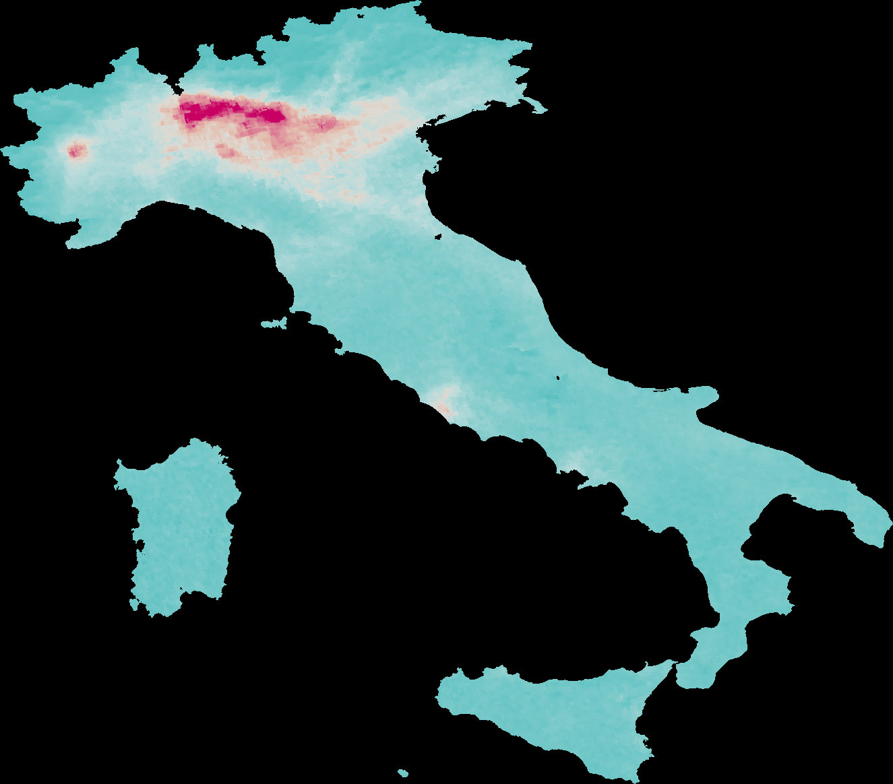
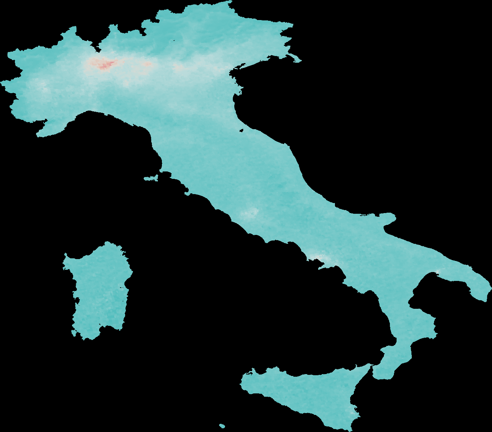
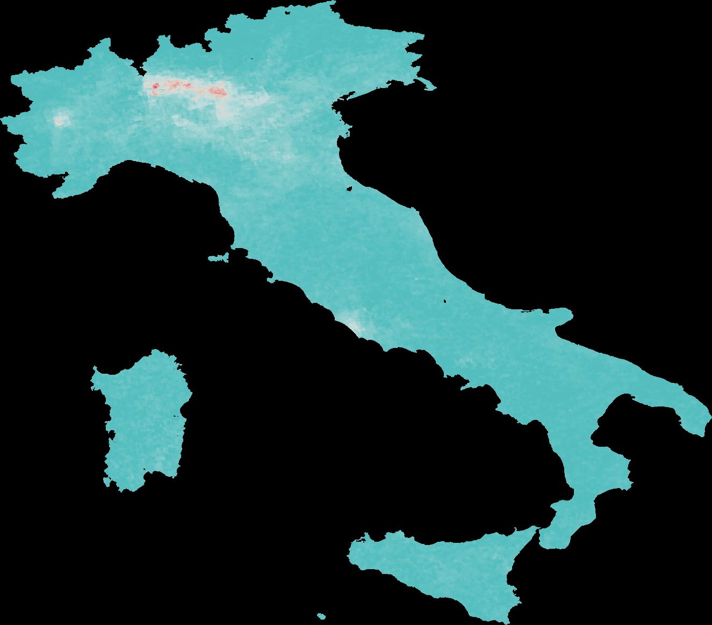
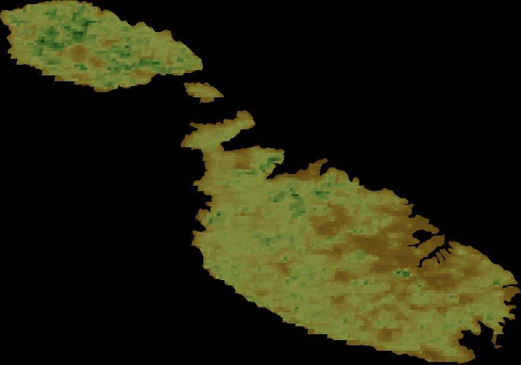
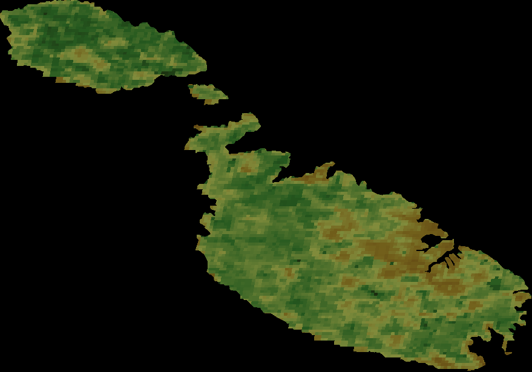
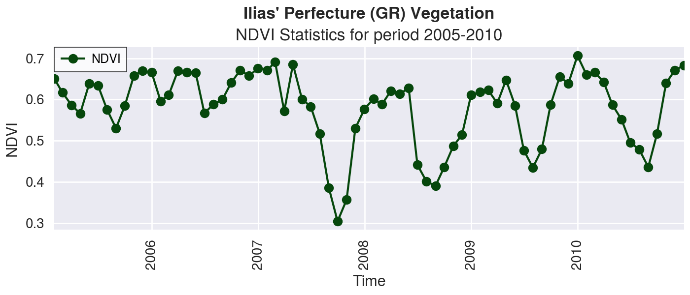
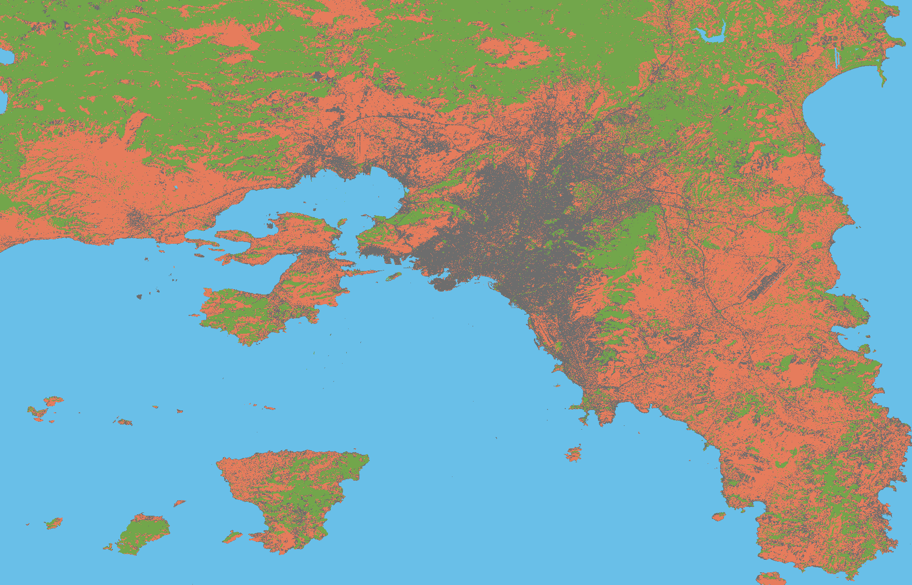
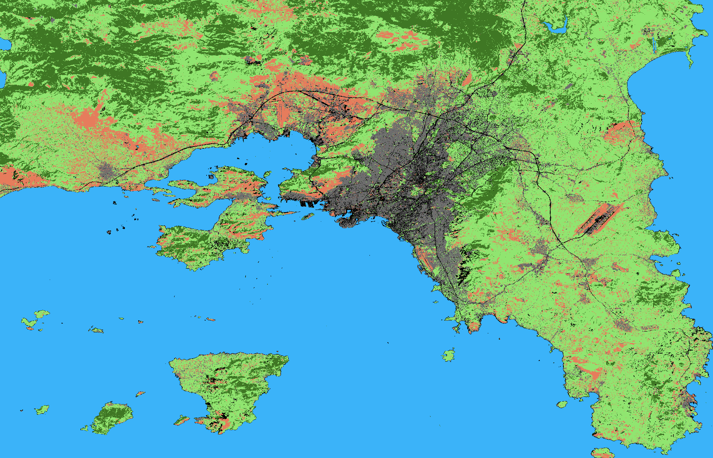

# Environmental Maps and Indexes with Google Earth Engine
This is a work on envronmental metrics using Google Earth Engine sets. It includes drop in NO2 emission during the COVID lockdown in Italy, NDVI for Malta, Atica classification based on land usage and others.

## NO2 emissions drop during COVID lockdown in Italy
These images depict a drop in NO2 emission during lockdown for COVID19 in Italy.
Before Lockdown:

During Lockdown:

Difference:

## Vegetation in Malta
Below there are two vegetation indexes for Malta: EVI & NDVI.
EVI:

NDVI

 
 ## Ilia's perfecture NDVI
 This is a chart for Ilias' Perfecture NDVI from years 2005-2010
 

 ## Attica environment classification
 These two images are a supervised classification of Attica's environment.
 4 Samples:
 
 6 Sample extended:
 

 ## Run on Google Collab
 Here is a link if you want to run the above in Google Colab: https://colab.research.google.com/drive/1FP1Z3EKWtttcody98ugQKVtWMyNt-jvw?usp=sharing